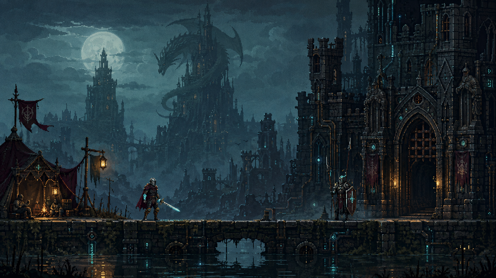

# 美術方向 v001

此圖是原創美術方向探索，由內建 image_gen 工具生成，完整提示詞保存在同目錄 `.prompt.txt`。沒有使用第三方參考圖片。它不是目前遊戲截圖，也不是可直接使用的角色動畫或無縫拼接圖塊。

## 本次方向

- 中古城塞、龍與魔法是世界主體，義肢、導管與符文能量融入鎧甲和建築。
- 冷灰藍遠景、暖琥珀營火、少量青色能源光、酒紅披風。
- 騎士需在小螢幕保持清楚輪廓；樣稿細節偏密，實際素材要再簡化和統一像素格。
- 保留遊戲平面：地面輪廓清楚，前景裝飾不遮擋敵人與攻擊預警。

## 製作順序

1. 先做騎士待機、跑步、跳躍、攻擊、受傷與衝刺，驗證角色尺寸及手機辨識度。
2. 做一組地面、平台和城門，以及可分層移動的遠景，用在目前訓練場。
3. 依同一規格擴充守衛、營地、義肢和龍；最後階段才是全遊戲的一致性整理。

## Godot 小教學

一張概念圖可以描述整體氣氛；真正遊戲裡，角色動畫通常交給 AnimatedSprite2D / SpriteFrames，地形可以使用 TileMapLayer，背景可分層。分開製作才能讓角色獨立移動、動畫與碰撞配合，並控制遮擋關係。騎士已有待機、跑步與新版六格下劈；守衛與鑄造場已接入第一輪素材，跳躍、衝刺與地形圖塊仍待製作。

## 遊戲素材與完整提示詞

以下各頁均連結原始生成圖、遊戲用圖及完整提示詞，所有原圖保留；本輪使用內建 image_gen，並沿用使用者已授權的本機圖片處理。

- [機械騎士：待機、跑步與下劈 v002](characters/knight/README.md)
- [鐵甲守衛 v001](characters/sentinel/README.md)
- [古城鑄造場 v001](environments/foundry/README.md)
