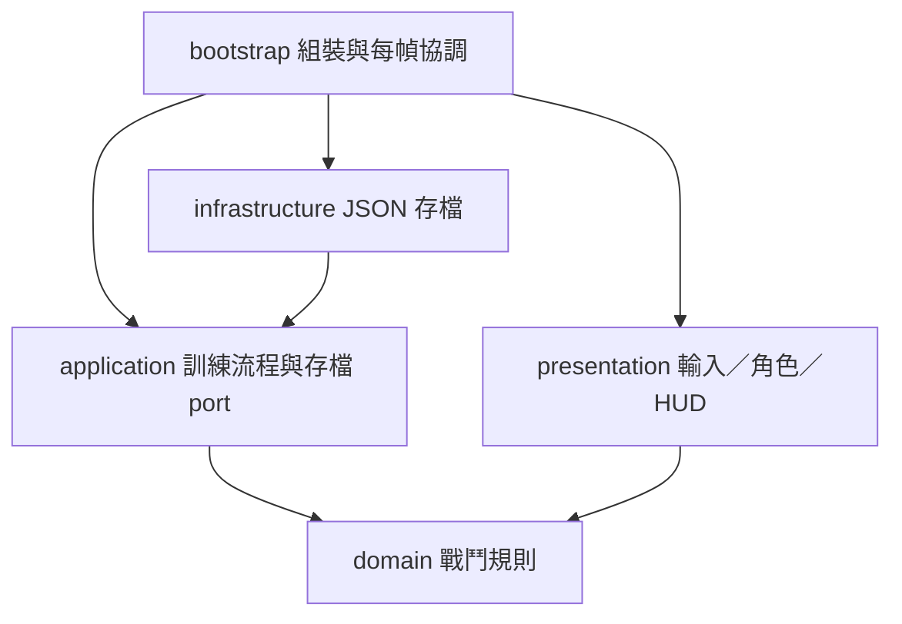

# 程式分層

採用 Clean Architecture 的依賴方向，規則先於引擎場景。這是適合一人遊戲的小型實作：內層使用 GDScript 的 RefCounted 與基礎型別，仍需要 Godot 執行，但不依賴節點樹、畫面、輸入或實際存檔。

| 想修改什麼 | 檔案／目錄 | 責任 |
| --- | --- | --- |
| 血量、傷害、速度 | data/knight.tres、sentinel.tres | 可由 Inspector 調整的 Resource |
| 命中、冷卻、無敵與體力 | domain/combatant.gd | 獨立戰鬥狀態與規則 |
| 敵人攻擊預警、擊敗獎勵與命中停頓 | application/training_session.gd | 協調一次訓練流程 |
| 如何保存廢料 | application/ports/progress_store.gd | 內層要求的存取介面 |
| JSON、錯誤與格式版本 | infrastructure/json_progress_store.gd | 真正檔案操作 |
| 角色動畫 | presentation/fighter_visual.gd、data/*_animation_frames.tres | 騎士與守衛共用播放、朝向和暫停邏輯，個別腳本只綁定素材 |
| 火花與鏡頭回饋 | presentation/impact_view.gd | 依確認命中顯示效果，不判斷傷害 |
| 場景美術 | presentation/arena_view.gd、art/environments/foundry | 背景圖及前景地面；碰撞仍由場景提供 |
| 跳躍、碰撞與角色畫法 | presentation/actor_body.gd | Godot 物理與畫面 |
| 鍵盤／觸控對應 | project.godot、presentation/input_adapter.gd | 將玩家輸入轉成指令 |
| 關卡位置、平台與攝影機 | scenes/training.tscn | 編輯器中的場景 |
| 組裝所有物件 | bootstrap/training_root.gd | 決定使用哪些數值與存檔實作 |

`ActorTuning` 是給編輯器用的 Resource；`tuning_mapper.gd` 將數值複製成內層資料，避免戰鬥規則直接載入 `.tres`。呈現層可以讀取戰鬥狀態，但傷害與獎勵判定集中在內層。

## 戰鬥與動畫時間

Combatant 持有整刀進度：前 40% 舉劍、40% 至 75% 可命中、最後 25% 收招。傷害窗口、揮劍畫格與刀光均讀取這份進度；呈現層不另設傷害計時器。起手時保存出劍朝向，途中反向移動不會把這一刀翻到背後；衝刺取消當前揮劍。即使冷卻比整刀短，也必須收招完畢才能再開始。

Bootstrap 先更新時間與物理位置，再結算雙方傷害，最後刷新角色畫面，讓死亡和受傷色調當幀反映。待機與跑步使用傳入的遊戲時間，揮劍依進度及 SpriteFrames 的每格時長選格；暫停時整個流程停止。衝刺依 domain 的 dash_progress 選取四格姿勢，短殘影在呈現層隨遊戲時間消退；跳躍仍暫用中立姿勢。

TrainingSession 的 advance 回傳扣除命中停頓後可用的遊戲時間；Bootstrap 用這份時間更新物理、預警、動畫、刀光與火花。resolve_sword／resolve_enemy_sword 只有真正扣血才回傳 true，空揮、無敵與同一刀重複接觸都不觸發停頓或火花。死亡仍能保留短暫命中效果。

停頓期間的 jump／attack／dash 暫存至下一個可更新時刻，執行時仍須通過正常的冷卻與體力規則。暫停、切到背景、重開會清除待執行操作；重開也清除火花與鏡頭偏移。沒有使用 Engine.time_scale，HUD 與暫停操作保持可用。

Godot move_and_slide 本身使用整個物理更新時間。ActorBody 在停頓結束只剩部分時間時，縮放此次移動速度並在碰撞後還原世界單位，防止多移動一整步。此情境有實際場景測試。

騎士八格斬擊時長權重為 0.10、0.10、0.10、0.10、0.15、0.20、0.10、0.15，第五、六格覆蓋有效揮擊窗口。預設整刀 0.34 秒，命中停頓 0.025 秒；30 FPS 呈現測試確認八格都能出現。若改動攻擊畫格權重或 domain 的有效時間，須一起核對命中格與場景測試；僅修改 attack FPS 不會改變遊戲傷害速度。

離線圖片處理留在 tools，原圖與配方留在 art；遊戲執行只讀已處理的 PNG 與 Godot 資源，不依賴 Python。

## 平台與跳躍

平台共用 scenes/platform.tscn，platform_body.gd 的 width 同時更新圖形與碰撞寬度；位置只在 training.tscn 配置，避免畫面和實際落點不一致。預設 jump_speed 520、gravity 1100，實際物理最高約 119 像素；四段平台路線另用引擎輸入測試每一次落地，不只檢查理論拋物線。

## 龍晶分配原型

- `domain/crystal_allocation.gd` 管理固定總量的分配與居民防護預估。`combatant.gd` 的護盾先承受傷害，完全擋住也算命中，維持原有無敵及一刀一次規則。
- `application/refuge_session.gd` 管理分配 → 出征 → 結果，配置只在分配階段可改。結果根據真實戰鬥快照結算一次並回傳副本；出征期間不能用重開補滿護盾。
- `bootstrap/refuge_root.gd` 注入數值與 MemoryProgressStore，再將同一個 TrainingSession 注入既有戰鬥場景。訓練場仍使用原 FileStore；被注入的出征不開正式存檔。
- `presentation/refuge_panel.gd` 呈現中文預估和結算、發出選擇意圖；`refuge_residents.gd` 只將快照畫成防護罩與受傷標記。沒有把居民規則放在 UI。
- `data/refuge.tres` 調整龍晶、每顆護盾、居民數；`data/expedition_knight.tres` 只調本原型的騎士生命。固定傷害魔潮是一輪結算模型，不是即時攻城或持續經濟。

原型重新分配會清除本輪戰鬥與報告，還原龍晶；歷次暫存廢料只用來計算本次取得差額，關閉原型即丟棄。UI 使用系統中文字型候選，Mac 已驗證，其他平台字型顯示仍須驗證。按鈕支援指標操作，整合測試將邏輯座標轉換成視窗輸入座標；這不替代手機多點觸控測試。

## 存檔邊界

Application 依賴 ProgressStore，正式場景注入 JsonProgressStore，流程測試注入 MemoryProgressStore。這讓獎勵與存檔失敗可以獨立測試，不必啟動整個遊戲。

存檔有版本號，寫入暫存檔後替換；未知版本、無效資料會保留原檔並報錯。這仍不是雲端同步、防作弊或完整斷電保證。讀取失敗後不自動覆蓋原檔，後續再提供使用者可選擇的復原流程。

## 測試範圍

- Domain：單次揮劍只命中一次、方向距離、攻擊窗口冷卻、衝刺體力與無敵、死亡、無效時間。
- Application：獎勵只領一次、高低差、重開、存檔失敗與重試、敵人先預警再攻擊。
- Infrastructure：存讀一致、未知版本與損壞資料保護。
- 場景整合：透過引擎輸入事件驗證移動、跳躍、衝刺、暫停、重開、擊殺與獨立存檔。
- Smoke：匯入專案、執行主場景 120 幀，攔截載入和執行錯誤。
- 人工：畫面、手感、多點觸控、裝置比例和手機效能。自動測試不代表已完成實機驗證。

現階段只在有真實邊界時設計 port，不加入 DI 容器、事件總線、ECS 或每個類別的介面。以後需要營地、商店、關卡種子時，再各自新增規則與測試。

## 可走動避難所

`domain/settlement.gd` 集中補給、身分、器具庫存、防線工單及護民塔消耗規則；世界位置使用純數值。`application/settlement_session.gd` 決定附近互動、居民走向器具／工地、守備反擊、夜襲預警及戰利品拾取，並重用 Combatant 的騎士劈砍與護盾規則。

`bootstrap/settlement_root.gd` 注入 Resource 數值，協調既有角色物理及模擬；`presentation/settlement_controls.gd` 統一 E 與既有操作，HUD 發出投入意圖。WorldView 根據模擬狀態顯示建築、庫存、工人和頭頂費用；沒有把居民身分改變藏在動畫或結果視窗內。

`data/settlement.tres` 可調起始資源、夜襲時間、居民速度與護盾量。所有新進度限本輪記憶體，不新增存檔 port 或寫入原有存檔。防線作為模擬中攔截敵人的目標，騎士可穿過，並非角色物理牆。現階段只做固定平地、一側夜襲，不提供跨平台居民尋路框架。

完整檢查包含居民自主完整路徑、實際近身攻擊、重新招攬就職、護民塔阻擋、倒數到期、守備兵反擊與一次性廢料拾取。場景測試以鍵盤／指標驗證投入、行走、施工、暫停、重試與騎士劈砍。

## 邊境探索與經濟

`domain/frontier.gd` 管理種子區塊、有限採集結果、農作及城鎮成本；`harvest_node.gd` 保存工作標記、工時、唯一承辦者及貨物狀態；資源已移除受傷介面，騎士戰鬥不再處理資源。種子使用 Godot 基礎 RNG，不載入場景、輸入或存檔。

`application/frontier_session.gd` 延伸已驗證的居民、夜襲與現場投入，新增採集、農夫／獵人、騎士訓練及王國判定。Settlement 的器具位置／職業以資料映射擴充，原場景仍可運作。`finished()` 仍僅代表三波結束，獨立的 `kingdom_established()` 檢查建城與居民，避免未建王城時錯誤生成第四波。

`scenes/frontier.tscn` 繼承 settlement 場景；`bootstrap/frontier_root.gd` 注入 frontier.tres 的種子與生產／訓練數值，依生成邊界建立實際地面、牆界、相機及平台。規則只傳普通數值；Resource 留在外層。場景與經濟共用同一組資源座標，平台使用原本的一致圖形／碰撞元件。

`presentation/frontier_*` 負責新圖意圖、HUD、森林晶礦／農田／城鎮示意。換圖與重試建立新的整輪模擬，不保存王國或改動訓練場存檔。城鎮成本與資源保底目前集中於 domain/frontier.gd，生產週期、產量與訓練數值則已開放 Inspector；增加調參需求時再擴充 Resource，避免每個生成細節都先做通用編輯器。

## 居民主導開拓與美術 v002

`application/frontier_workforce.gd` 排程工匠到場、爬梯、工作、搬運與送貨；受到攻擊失去職業時釋放工作、放下貨物，接手者不能重複領取同一批。先完成手上的運送，再優先已付款施工，其餘選最近標記點。`domain/harvest_node.gd` 計算純工作進度，`domain/frontier.gd` 管理一次性入庫、拓荒站成本與完成。工作進度不等同戰鬥血量。

SettlementSession 提供 `_engineer_target` 小型擴充點；原場景只建牆，FrontierSession 接入工作排程。所有居民仍由同一段移動更新推進，避免基底和子類各走一次。高台使用普通 y 數值與可見梯子，未建立自由導航／複雜尋路框架；敵人實際命中也檢查居民高度。

`data/frontier_art.tres` 管理新景觀、道具與居民圖集，WorldView 的結構、活動、人物呈現可分別替換。動畫讀模擬時間與工作狀態，所以暫停時凍結；腳底由離線切格統一對齊。神情／像素品質與手機可讀性仍需後續試玩。

生成原圖、提示詞與整理配方保存在 `art/frontier/v002/`，來源資料夾以 .gdignore 排除遊戲匯入。`tools/prepare_resident_art.py` 從專案中的原圖重建 PNG，不依賴產圖服務、API key 或原電腦生成目錄。遊戲只讀整理好的 PNG；Python／NumPy／Pillow 僅用於離線素材工作。
