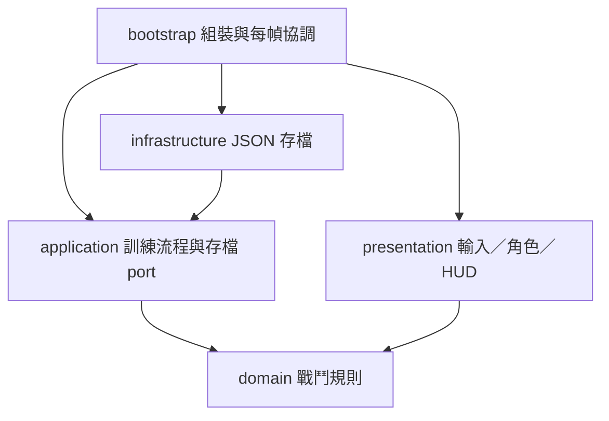

# 程式分層

採用 Clean Architecture 的依賴方向，規則先於引擎場景。這是適合一人遊戲的小型實作：內層使用 GDScript 的 RefCounted 與基礎型別，仍需要 Godot 執行，但不依賴節點樹、畫面、輸入或實際存檔。

| 想修改什麼 | 檔案／目錄 | 責任 |
| --- | --- | --- |
| 血量、傷害、速度 | data/knight.tres、sentinel.tres | 可由 Inspector 調整的 Resource |
| 命中、冷卻、無敵與體力 | domain/combatant.gd | 獨立戰鬥狀態與規則 |
| 敵人攻擊預警、擊敗獎勵 | application/training_session.gd | 協調一次訓練流程 |
| 如何保存廢料 | application/ports/progress_store.gd | 內層要求的存取介面 |
| JSON、錯誤與格式版本 | infrastructure/json_progress_store.gd | 真正檔案操作 |
| 騎士待機、跑步與揮劍 | presentation/knight_visual.gd、data/knight_animation_frames.tres | 素材、循環時間及依戰鬥進度選格，不控制傷害 |
| 跳躍、碰撞與角色畫法 | presentation/actor_body.gd | Godot 物理與畫面 |
| 鍵盤／觸控對應 | project.godot、presentation/input_adapter.gd | 將玩家輸入轉成指令 |
| 關卡位置、平台與攝影機 | scenes/training.tscn | 編輯器中的場景 |
| 組裝所有物件 | bootstrap/training_root.gd | 決定使用哪些數值與存檔實作 |

`ActorTuning` 是給編輯器用的 Resource；`tuning_mapper.gd` 將數值複製成內層資料，避免戰鬥規則直接載入 `.tres`。呈現層可以讀取戰鬥狀態，但傷害與獎勵判定集中在內層。

## 戰鬥與動畫時間

Combatant 持有整刀進度：前 25% 起手、中間 50% 可命中、最後 25% 收招。傷害窗口、揮劍畫格與刀光均讀取這份進度；呈現層不另設傷害計時器。起手時保存出劍朝向，途中反向移動不會把這一刀翻到背後；衝刺取消當前揮劍。即使冷卻比整刀短，也必須收招完畢才能再開始。

Bootstrap 先更新時間與物理位置，再結算雙方傷害，最後刷新角色畫面，讓死亡和受傷色調當幀反映。待機與跑步使用傳入的遊戲時間，揮劍依進度選四格；暫停時整個流程停止。跳躍、衝刺專用圖尚未製作，暫時固定中立姿勢。

離線圖片處理留在 tools，原圖與配方留在 art；遊戲執行只讀已處理的 PNG 與 Godot 資源，不依賴 Python。

## 存檔邊界

Application 依賴 ProgressStore，正式場景注入 JsonProgressStore，流程測試注入 MemoryProgressStore。這讓獎勵與存檔失敗可以獨立測試，不必啟動整個遊戲。

存檔有版本號，寫入暫存檔後替換；未知版本、無效資料會保留原檔並報錯。這仍不是雲端同步、防作弊或完整斷電保證。讀取失敗後不自動覆蓋原檔，後續再提供使用者可選擇的復原流程。

## 測試範圍

- Domain：單次揮劍只命中一次、方向距離、攻擊窗口冷卻、衝刺體力與無敵、死亡、無效時間。
- Application：獎勵只領一次、高低差、重開、存檔失敗與重試、敵人先預警再攻擊。
- Infrastructure：存讀一致、未知版本與損壞資料保護。
- 場景整合：透過引擎輸入事件驗證移動、跳躍、衝刺、暫停、重開、擊殺與獨立存檔。
- Smoke：匯入專案、執行主場景 120 幀，攔截載入和執行錯誤。
- 人工：畫面、手感、多點觸控、裝置比例和手機效能。自動測試不代表已完成實機驗證。

現階段只在有真實邊界時設計 port，不加入 DI 容器、事件總線、ECS 或每個類別的介面。以後需要營地、商店、關卡種子時，再各自新增規則與測試。
