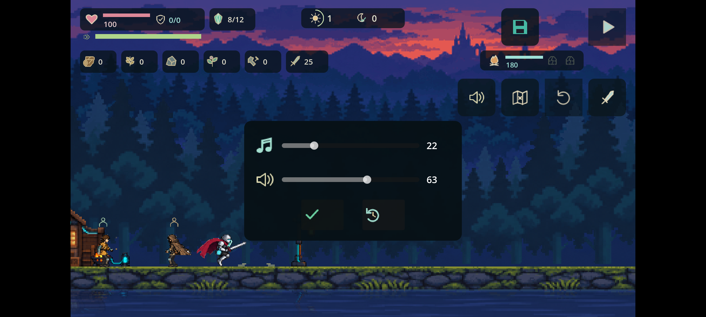
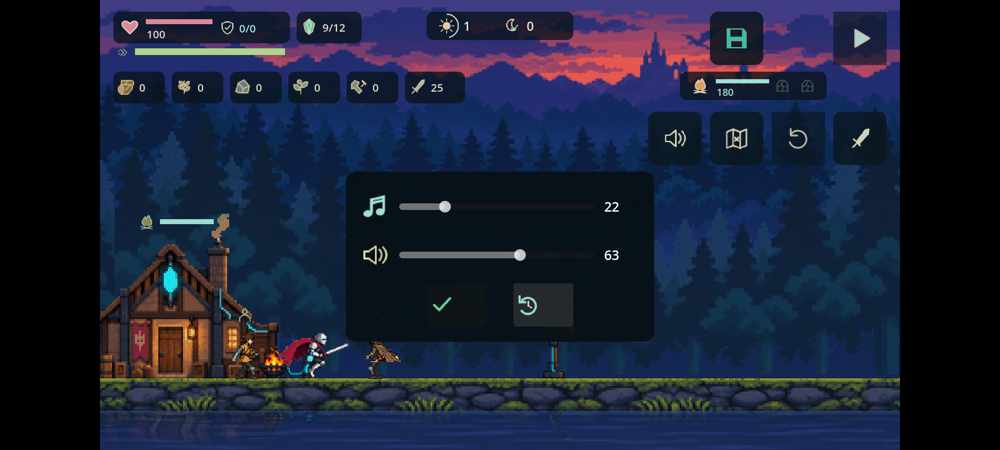

# Android 安裝版：觸控與存檔驗證

2026-09-13，使用 de83023 的既有 Android debug APK，沒有重建或修改遊戲規則。本次為 Android 15／API 35 ARM64 模擬器上的真實 APK 操作，不是 Android 實體手機驗收。來源、雜湊、完整比較結果見 manifest.json。

## 已驗證

- 覆蓋安裝成功，既有 v1 存檔逐位元組保持；遊戲載入轉為 v2，保留地圖、居民／資源與騎士位置，攻擊／跳躍成本為 12／18。舊地圖保持原尺寸。
- 系統觸控右移、丟晶與衝刺：騎士 x 從 156.67 到 368.50，背包從 9 到 8；暫停時仍有 0.1 秒衝刺、體力 72.5。這是動作進行中的快照，不以此推論精確扣除量或 FPS。
- 觸控調音樂至 22%、音效至 63%，建立手動檢查點；後續遊玩沒有改寫手動槽。
- 第二個獨立情境：右移、丟晶，暫停時 x=292.83、8 晶；強制停止後冷啟動，等實際選單可見，完整自動存檔保持一致。
- 點手動讀取，畫面回到 9 晶與原位置。進入背景並等儲存完成後，整份戰役快照與原手動檢查點完全一致，並非只比較背包數字。
- 冷啟動與手動還原畫面均保留音量 22／63。手機顯示觸控操作，沒有桌面 E 提示與全螢幕按鈕。

## 驗證方法與限制

首次冷啟動截圖仍是 Godot 啟動畫面，未採用為成功證據；改為等可見選單後重新完成操作與比較。背景儲存有非同步延遲，立即讀檔可能還是舊值，因此採後續儲存完成結果。

沒有提交原始測試存檔，僅摘要與 SHA-256。模擬器以唯讀 AVD 啟動，測試後關閉，沒有清除原始 AVD 資料。最後嘗試再讀音量檔時裝置短暫 offline，未取得新副本；音量持久化的證據是之前已取得的設定與本次兩張可見選單畫面。

應用日誌無 SCRIPT ERROR 或 AndroidRuntime fatal；有快取 shader 重新編譯警告，隨後正常顯示遊戲。音訊輸出停用，不聲稱音質、多指觸控、實機效能或完整通關已驗證。真人難度與動作美感仍待驗收。

隔離副本的所有已追蹤程式、設定、場景與檢查腳本均與 de83023 相同，完整 tools/check.sh 再次通過，紀錄見 full-check.log。初次沙盒執行因無權寫 Godot 編輯器設定而中止，取得本機執行授權後通過；未修改遊戲來掩蓋環境錯誤。

## iOS 前置更新

Xcode 26.6（17F113）、iPhoneOS 26.5 SDK 與 Godot iOS 模板可用；首次設定檢查通過，條款阻擋已解除。真實 Team ID 尚未提供，devicectl 沒有列出連接裝置，可用程式簽署身分為 0。ios-preflight.json 顯示尚不可匯出／安裝，未產生 iOS 專案或 IPA。不能用此 Android 成果替代 iPhone 驗收。
