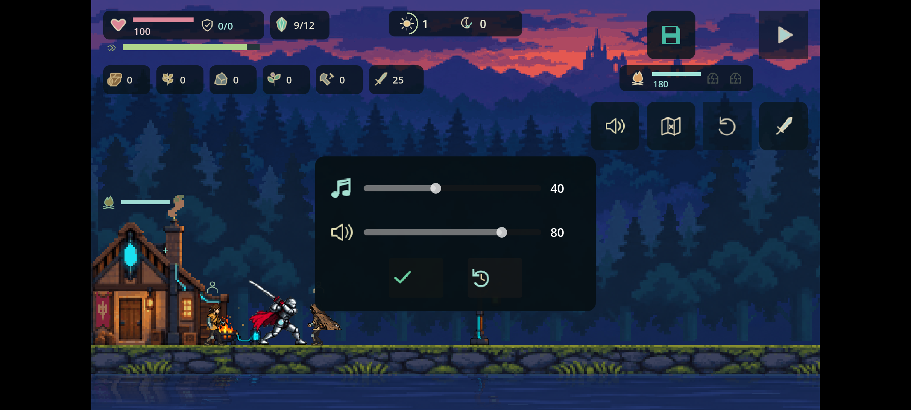
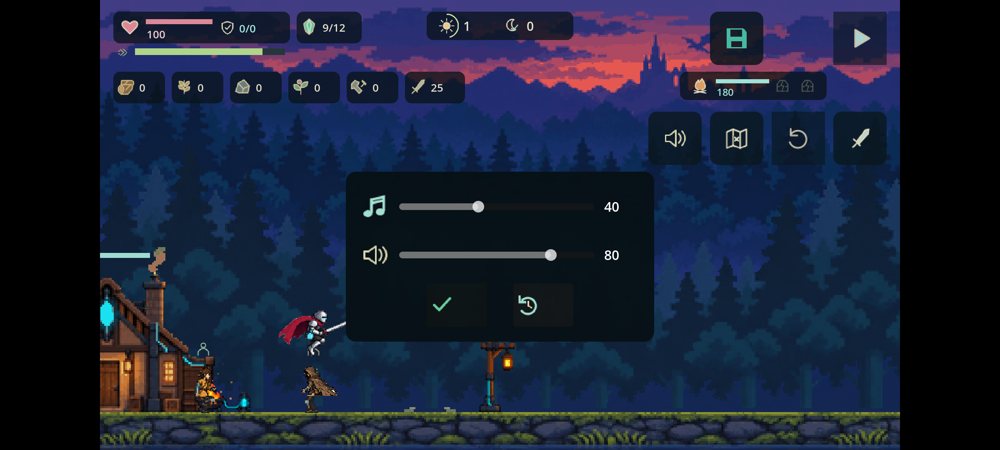
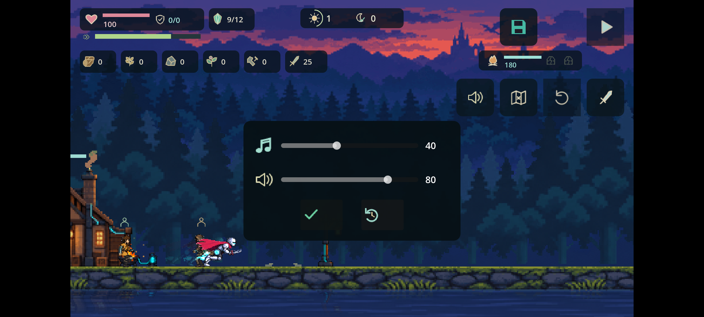

# Android 安裝版多指操作驗證

2026-09-13。沿用 de83023 的 Android debug APK，沒有改遊戲規則或重建套件。測試在唯讀 AVD 的 Android 15 ARM64 模擬器完成；模擬器現已關閉，原始 AVD 資料保留。

## 結果

| 情境 | 遊戲內結果 |
| --- | --- |
| 按右移，同時用第二指跳躍 | 水平速度 190、垂直速度 -373.33，離地上升，體力 84.92 |
| 按右移，同時用第二指衝刺 | 水平速度 540、剩餘衝刺 0.117 秒，體力 72.08 |
| 按右移，同時用第二指出刀 | 第一刀剩餘 0.24 秒，水平速度 0，體力 90.5 |
| 暫停後放開所有手指，再繼續且不輸入 | 收招後 x 仍為 185.1667，沒有殘留移動 |
| 再按新移動手勢 | x 增至 283.3336，控制仍可使用 |

體力為動作經過恢復時間後的快照，不是精確成本；實際成本仍為跳 18、衝刺 30、每刀 12。原始比較快照保留在暫存目錄，不提交 Git；manifest.json 記錄必要欄位及 SHA-256。

## 可重現方法

`tools/android/MultiTouch.java` 是外部測試器，以 Android SDK android.jar 編譯、d8 轉 dex，放在模擬器 /data/local/tmp，用 adb shell 的 app_process 執行。它沒有被注入 APK，也不修改遊戲記憶體或存檔。Android MotionEvent 支援多個 pointer；注入介面依 [AOSP InputManagerGlobal](https://android.googlesource.com/platform/frameworks/base/+/refs/heads/main/core/java/android/hardware/input/InputManagerGlobal.java) 核對。本工具使用 Android 15 的系統介面，未聲稱其他版本相容。

參數為 `x1 y1 x2 y2 lead_ms overlap_ms tail_ms [pause_x pause_y]`，座標使用實際 2400×1080 螢幕。第一指按住右移 (488,985)，第二指為跳 (1915,985)、衝刺 (1765,985) 或劍 (2068,985)；先按方向 200ms，重疊 120ms（跳）／100ms（衝刺、劍）。第三指按暫停 (2068,88)，其餘手指隨後釋放。

每組從畫面讀取同一手動檢查點、按播放，才注入手勢；不是直接修改存檔建立有利結果。三份 input.log 均有成功的單指、雙指、第三指暫停及釋放事件。快照確認真正的角色物理與動作，而非只以「注入成功」算遊戲成功。截圖在暫停後取得，因此不是連續動作美感驗收。

## 除錯與驗證界線

最初測試器在 ACTION_UP 後又送 ACTION_CANCEL，Android InputDispatcher 明確拒絕「Existing pointers: {}」並使測試器未處理例外終止。移除正常完成後多餘取消；失敗時才嘗試清理，保留原始例外。重跑三組成功。這是測試器錯誤，不是遊戲崩潰。

一次 adb 連線短暫 offline 發生於新手勢第一個按鍵之前，確認同一模擬器重新連線後才重試，沒有重新建立裝置或覆寫進度。

本次 Godot 應用日誌沒有 SCRIPT ERROR，仍有既有快取 shader 重新編譯警告。完整 tools/check.sh 通過。多指事件經 Android 系統傳給真正 APK，補足之前僅在 Godot 場景發送 ScreenTouch 的證據；仍不等於 iPhone／Android 實體手指舒適度、音訊、FPS、連斬多指全流程或真人難度驗收。
